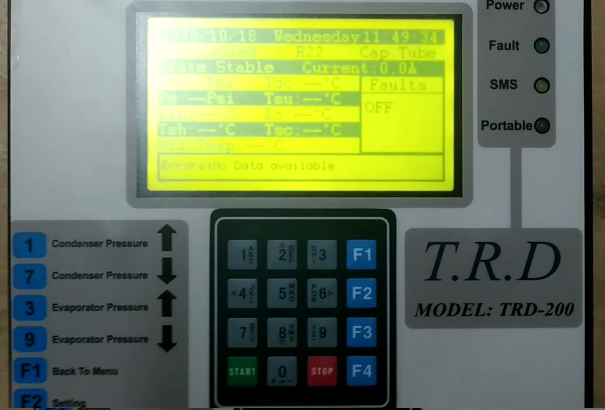
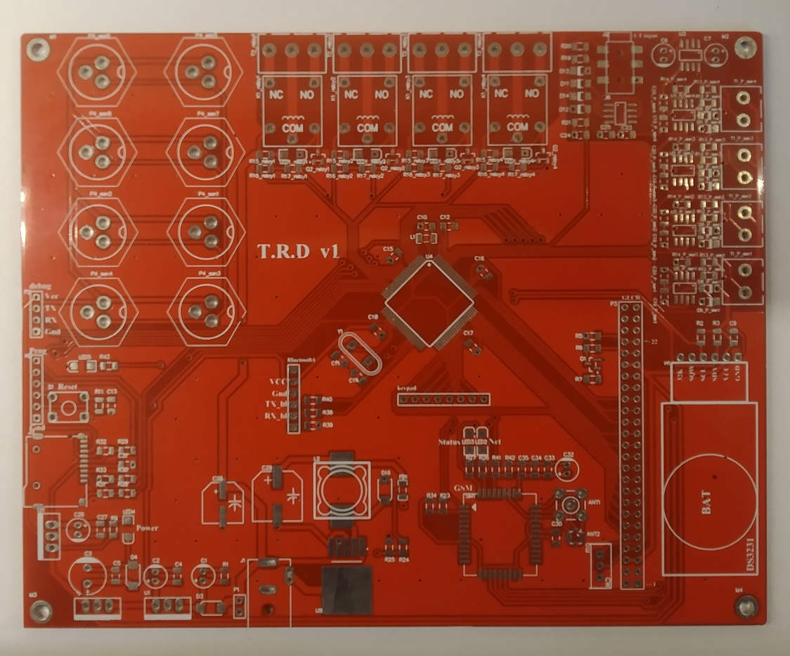

# Refrigration Trubleshooting Device
### My first free-lancer project
This project is one of my non-academic and professional projects. My job was to design a PCB and write the code for diagnosing a refrigeration system. The desired device had to have 2 pressure, and at least 4 temperature inputs. It also should be able to measure the system compressor current and accommodate 4 output relays. Device user interface consisted of a 256 by 128 pixel graphic LCD display and a 4 by 4 keypad.
This device measures all the pressures and temperatures of a refrigeration device and based on a diagnostic algorithm displays errors and warnings for the user.
A GSM SIM800 module was used to send critical error messages to the operator.
For the temperature sensors, I used DS18b20 digital addressable temperature sensor which could be used via one-wire bus. 
An Atmega2560 is at the heart of the PCB, running the algorithm.

- device front User Interface

- photo of PCB
